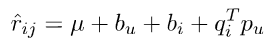
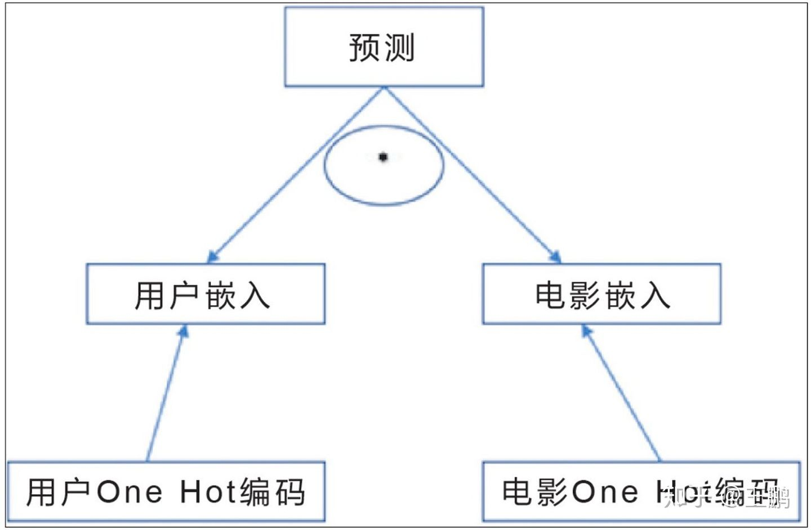

# 文档搜索引擎实践

<center><h5>PB18000028 邱子悦</h5></center>

<center><h5>PB18000058 丁垣天</h5></center>

[TOC]

## 1 实验目的

通过推荐系统实践，学习信息挖掘技术。

## 2 实验简介

数据来源为豆瓣电影的评分记录。 根据训练数据中的用户评分信息，判断用户偏好，并为测试数据中 user-item 对进行评分。

必备考核内容:个性化推荐技术(方法自选)。

可选考核内容:标签处理(NLP 技术)、社交推荐(社交网络分析技术)。

基于评分预测的 RMSE 指标进行评估。

## 3 实验说明


## 4 实验过程

### 4.1 Bias-SVD

推荐系统中最为主流与经典的技术之一是协同过滤技术，可根据是否采用了机器学习思想建模的不同划分为基于内存的协同过滤（Memory-based CF）与基于模型的协同过滤技术（Model-based CF）。基于模型的协同过滤技术中尤为矩阵分解（Matrix Factorization）技术最为普遍和流行，因为它的**可扩展性极好并且易于实现**。

#### 4.1.1 矩阵分解

评分预测的思路是将已有的评分矩阵 (items - users) 拆成 (items - factors) * (factors - users)，揭示潜在因子。当用户与物品的潜在因子已知，则任何缺失的评分，均可以通过分解出的两个矩阵行列运算得到。这利用的便是矩阵分解技术，其中使用广泛的是奇异值分解 (SVD)。

但是，SVD 要求矩阵是稠密的。直接用传统 SVD 算法并不是一个好选择。

#### 4.1.2 Funk-SVD

Funk-SVD 借鉴线性回归的思想，通过最小化观察数据的平方来寻求最优的用户和项目的隐含向量表示。这种方法被称之为隐语义模型 (Latent factor model, LFM)，其算法意义层面的解释为通过隐含特征 (latent factor) 将 user 兴趣与 item 特征联系起来。

#### 4.1.3 Bias-SVD

在 Funk-SVD 提出来之后，陆续又提出了许多变形版本，其中相对流行的方法是 Bias-SVD。

对于一个评分系统有些固有属性和用户物品无关，而用户也有些属性和物品无关，物品也有些属性与用户无关，具体的预测公式如下：



其中 $\mu$ 为整个网站的平均评分； $b_u$ 为用户的评分偏置，$b_i$ 为项目的被评分偏置。

### 4.2 算法实现

#### 4.2.1 自动微分梯度下降

上面的算法需要计算每一个参数所对应的梯度，需要进行非常复杂的计算。为了简化这一过程，我们可以借助深度学习框架帮助我们完成自动微分和梯度下降的过程。

使用 PyTorch等深度学习框架等好处在于：

* 利用深度学习框架 PyTorch，我们可以非常方便地使用各种优化器，比如，我们可以使用随机梯度下降优化器来优化我们的学习结果。

```python
optimizer = optim.SGD(model.parameters(), lr=0.01) # 使用随机梯度下降优化器

data_list = list(dataloader) # 预先读取到内存中加速计算。
for epoch in range(epochs):
    for i, (user, movie, score, weight) in enumerate(data_list):
        optimizer.zero_grad()

        pred = model(user, movie) # 前向传播
        loss = criterion(pred, score, weight) # 计算 loss
        loss.backward() # 根据梯度反向转播

        optimizer.step() # 使用 SGD 优化器更新权值。
```

* 另外，借助深度学习框架，我们可以将我们的代码放入 GPU 执行来提高运行效率。这里，我们采用 PyTorch 自带的 `DataParallel` 在单台机器上进行多 GPU 分布式机器学习。

```python
model = DualEmbedding(user_n, movie_n, k).cuda()
model = DataParallel(model, device_ids=gpus, output_device=gpus[0])
```

#### 4.2.2 用 embedding 的方法实现矩阵分解

为了便于我们在Pytorch 中实现矩阵分解，我们需要将之前的矩阵分解过程重新使用 Embedding 来理解。

我们将用户矩阵和电影矩阵看作是将用户和电影映射到向量空间的一种嵌入（Embedding）。整个预测的过程如下：先分别将用户ID和电影ID转化成其对应的嵌入向量，然后将两向量点积，得到用户和电影之间的相似度，再对其使用一个激活函数（如sigmoid）得到用户对电影的评分。



我们使用 pytorch 来实现如下：

```python
class DualEmbedding(nn.Module):
    def __init__(self, user_n, movie_n, k):
        super(DualEmbedding, self).__init__()
        self.user_embed = nn.Embedding(user_n, k)
        self.user_bias = nn.Embedding(user_n, 1)
        self.movie_embed = nn.Embedding(movie_n, k)
        self.movie_bias = nn.Embedding(movie_n, 1)
    
    def forward(self, user, movie):
        user_feat = self.user_embed(user)
        movie_feat = self.movie_embed(movie)
        dot_product = torch.sum(user_feat * movie_feat, dim=-1)
        result = dot_product + user_bias[user] + movie_bias[movie]
        return torch.sigmoid(dot_product)
```

#### 4.2.3 正则化

当我们矩阵分解中 K 值取的比较大的时候，我们参数的总量 $ (M + N) \times (K + 1) $ 会变得特别大，为防止过多的参数引起的过拟合问题，我们需要对整个矩阵分解过程进行正则化。

即在原有最优化函数中加入正则项，为了让 Embedding 矩阵尽可能稀疏，我们使用 L1 范数进行正则化，整个最优化函数如下：（$g(x)$ 为  Sigmoid函数）
$$
\min_{P,Q} \sum_\text{training} (R_{ij} - g(M_i + U_j + Q_i P_j))^2 + \lambda (\| M \|_1  + \| U \|_1  + \| P \|_1 +  \| Q \|_1)
$$
我们取 $K = 20$ 时，发现 $\lambda$ 在取 $\lambda = 10^{-2}$ 时达到最优效果。


### 4.3 利用社交网络和标签信息

#### 4.3.1 社交约束

在矩阵分解领域中，往往可以通过增加更多的信息和假设来实现更好的结果。为了利用丰富的社交网络信息，我们为我们的矩阵分解增加社交约束。

我们的方法基于论文 [SoRec: Social Recommendation Using Probabilistic Matrix Factorization](https://www.researchgate.net/publication/221615498_SoRec_Social_recommendation_using_probabilistic_matrix_factorization) 。该论文首先定义用户对其他用户的信任程度 $ c^\ast_{ik} = \sqrt \frac{d^-(u_k)}{d^-(u_k)+d^+(u_i)} \times c_{ik}$  （由于数据集中没有给出具体的信任程度 $c_{ik}$ ，我们默认当用户 $i$ 关注 $j$ 时 $c_{ik} = 1$），基于 $c^\ast_{ik}$ 我们可以写出包含社交约束的损失函数。（Q 表示用户对应的矩阵，P表示电影对应的矩阵，K表示新加入的矩阵，省略偏置和正则项）
$$
L(R,P,Q,K) = \sum_{用户 i 给 电影j 评过分} (R_{ij} - g(Q_i P_j))^2  + \lambda_C \sum_{用户i 关注 j}(c^\ast_{ij} - g(Q_i K_j))^2
$$
这里取 $\lambda_C = 0.05$ 就可以得到比较好的效果。

#### 4.3.2 标签信息约束

由于社交约束与用户直接相关，而标签信息与电影直接相关，类比社交约束中的公式，定义 $ l^\ast_{ij} = \sqrt\frac{d^-(m_k)}{d^-(m_k)+d^+(\text{label}_i)}$ 我们可以写出
$$
L(R,P,Q,K,L) = \sum_{用户 i 给 电影j 评过分} (R_{ij} - g(Q_i P_j))^2  + \lambda_C \sum_{用户i 关注 j}(c^\ast_{ij} - g(Q_i K_j))^2 + \lambda_L \sum_{电影j 具有标签 i} (l^\ast_{ij} - g(L_i P_j))^2
$$
其中矩阵 $L$ 表示标签的嵌入向量（Embedding）。

#### 4.3.3 实现方法

虽然上面的公式非常复杂，但换一种角度来说，其实就是相当于将标签看作用户、将被关注的用户看作电影，然后根据不同的权值$1$ 或 $\lambda_C$ 或 $\lambda_L$ 进行训练。我们在训练集中加入权重（weight）的数据，用来表示其误差函数的权值为 $1$ 、 $\lambda_C$ 还是 $\lambda_L$ 。然后简单修改loss函数即可：

```python
def criterion(prediction, score, weight):
    return torch.dot(weight, (prediction - score)**2)

loss = criterion(pred, score, weight) + l1_loss
```


## 5 实验结果

### 5.1 梯度下降效果


### 5.2 RMSE

### 5.3 部分结果分析

